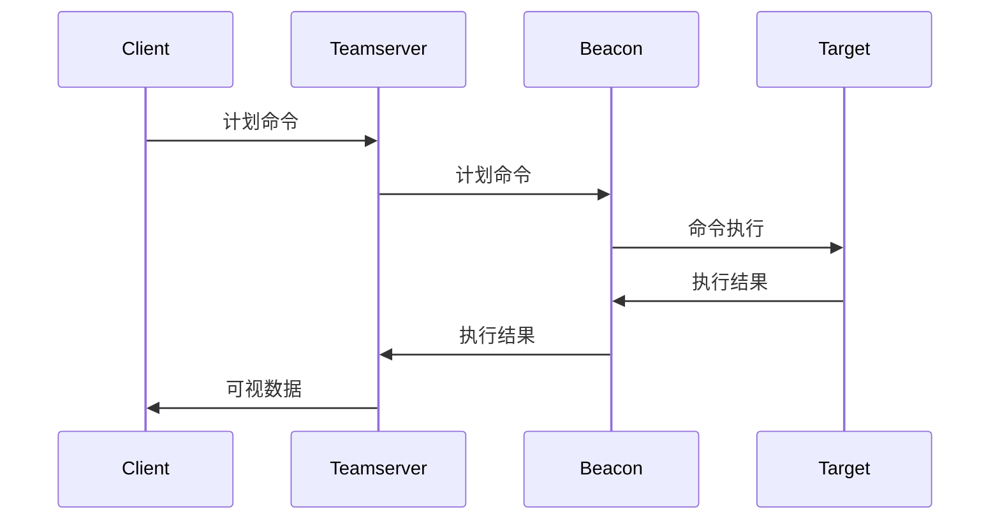

# 1.2.2 深入了解 C\&C 服务器及相关基础设施

## 何为 C\&C 服务器

C\&C 服务器是由攻击者控制的计算机，用于向被恶意软件入侵的系统发送命令，并从目标网络接收被盗数据。还可以充当僵尸网络中的“主控机”，控制受控主机

> 僵尸网络是由感染恶意软件的计算机构成的网络，由攻击者或网络犯罪分子控制。僵尸网络中的计算机可用于发起协同攻击，如帐户接管、分布式拒绝服务 (DDoS) 攻击和网络钓鱼攻击，从而窃取敏感信息

## Cobalt Strike C\&C 通讯流程

1. 攻击者在 Client 上进行操作，操作转为计划命令，命令按照时间顺序依次发送到 Teamserver 上等待执行
2. Teamserver 将命令按照顺序发送到 Beacon ，由 Beacon 在 Target（目标机器）上进行命令执行
3. Beacon 将执行后的结果回传 Teamserver ，Teamserver 再将结果回传到 Client ，最终转为攻击者可视的数据



这里有一个小细节要注意，由 Client 发出的指令并不是通过 Teamserver（或外部 C2）直接转发给 Beacon 并执行命令，而是 Beacon 固定一段时间（由 Sleep 时间决定，可调整）向 Teamserver 发起通信，接受本次命令并回传上次执行命令后的结果

## C\&C 服务器

### Malleable C\&C（可塑 C2）

我们可以将 Malleable C\&C 看作是类原生的一套 C2 框架，这套框架并非我们编写，但是我们可以通过调整参数的方法使我们通信过程更加隐蔽

还可以结合其他攻击手法如开源情报搜集 流量混淆等，攻击者可以通过 Malleable C\&C 使 Beacon 的恶意流量更像所属网络环境中的正常流量，最终实现绕过流量审查的目的


在启动 Teamserver 时包含 Malleable C\&C 配置文件即可将流量进行修改

```
./teamserver [external IP] [password] [/path/to/my.profile]
```

### External C\&C（外部 C2）

Cobalt Strike 3.6 版本，官方为 Beacon 新增了一条 API，此 API 允许用户使用 External C\&C ，攻击者可以利用这个功能拓展 C\&C 通信渠道，而不局限于默认提供的 `HTTP(S)/DNS/SMB/TCP` 通道，并提出了 External C\&C 即外部 C\&C 服务器的概念

在 Cobalt Strike 4.0 更新时，官方引入了一种新的监听器类型，扩充了一种外部 C\&C Payload 选项，至此 External C2 得到了更直接的利用方法

External C2 是指通过 CobaltStrike 与第三方 C2 通信，相比 Malleable C\&C 可自定义程度更高，我们完全可以根据自己的想法从零编写一套 External C\&C 框架。目前也有一些成熟的第三方 External C\&C 框架可供使用，例如 `Metasploit`、`Empire` 等等，外部 C2 相当于是一层代理，更使通信过程更加隐蔽，图引 @Snowming04 师傅


### C\&C Redirectors（C2 重定向器）

从名字可以便见得，C2 重定向器的主要任务是将受控主机与 C\&C 服务器的流量进行转发，相当于在 C\&C 服务器前加上了一层代理，通过 C2 重定向器时，C\&C 服务器向受控主机发送指令为正向代理，回传数据则为反向代理，当攻击被感知时，溯源者可见的仅有提供定向的服务器

C2 重定向器的意义：

* 隐藏后端真实服务器
* 使功能与流量进行分离，可根据战术规划自由选择服务器
* 模仿真实通信

在 Cobalt Strike 中使用 C2 重定向器时，需要在设置监听器时填入 `Host` 字段，Cobalt Strike 仅验证服务器是否属于 Teamserver，若不是则自动是为 C2 重定向器

## C3 框架

C3 框架全称为 Custom Command and Control，与 C2 框架相比，多了 `Custom（定制）` 一词。Cobalt Strike 支持攻击者使用 OneDrive、Slack、Telegram 等应用混淆流量，这部分并非 Cobalt Strike 的原生功能，仅作为扩展知识解释，更多可参考此开源项目：

```
https://github.com/WithSecureLabs/C3
```
