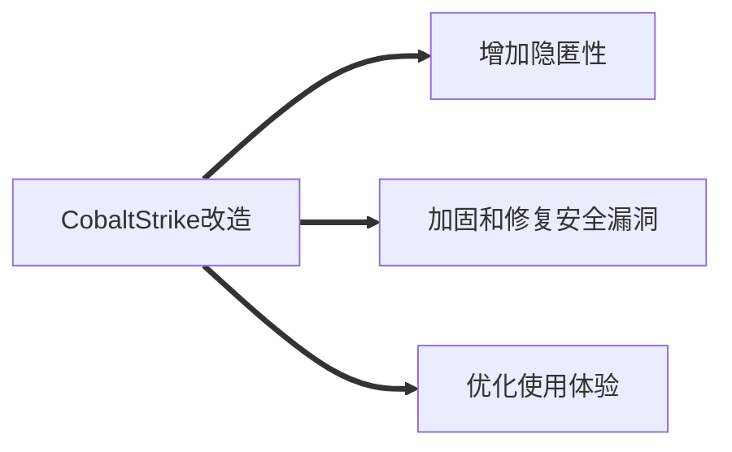

# 0x00 相关

官网：

[Cobalt Strike | Adversary Simulation and Red Team Operations](https://www.cobaltstrike.com/)

# 0x01 Cobalt Strike 安装指南

## 0x01-1 常用环境

| 服务端 | 服务端环境 | GUI 客户端 | SSH 工具 |
| --- | --- | --- | --- |
| Centos 7.6 | Oracle Java 11 | Windows / Linux kali | FinalShell |

## 0x01-2 安装过程

## 一. 安装 Open JDK 环境

CS 官方建议安装 `JDK 11/1.8` ，所以这里我们用 `JDK 11` 作为例子，如果服务器开机自带 Java 环境，**建议先卸载，防止环境混乱**

1. 输入命令（**二选一即可**）

```bash
yum install java-11-openjdk-devel #jdk 11

yum install java-1.8.0-openjdk* -y #jdk 1.8
```

1. 如果你的系统中还装有不同版本的 JDK 的话，请使用 `alternatives --config java` 对默认运行的 Java 版本进行选择，或使用 `rpm -qa | grep java | xargs rpm -e --nodeps` 进行删除


1. 验证 Java 环境是否成功配置，运行Java版本检查命令：

```bash
java -version
```

如图显示则为成功安装


## 二. 配置服务端

### 1. 资源下载

我使用的软件包是 @www.ddosi.org 上的 Cobalt Strike 4.5 + CS Agent 版本，这里同时放出原版

[Coablt strike_4.5](Cobalt%20Strike%2016f509fd6e95475c83832ae9e3e1730c/cobaltstrike_4.5.jar%25E5%258E%259F%25E7%2589%2588.zip)

[Coablt strike_4.5+CSAgent .zip](Cobalt%20Strike%2016f509fd6e95475c83832ae9e3e1730c/coablt_strike_4.5CSAgent_.zip)

部分破解版本有可能会带有木马。另外即使没有后门，CS本身也是会报毒，因为本身带很多攻击性的payload，可以通过此页面进行判断是否来自官方：

[Hash查验方法 & Cobalt Strike 官方 Hash 列表](https://www.notion.so/Hash-Cobalt-Strike-Hash-84b2e68a89f945c7a25b6beda5878c33)

### 2. **CSAgent 说明**

原项目地址：‣ （由于 DMCA 删除，存储库不可用）

说明：`Cobalt Strike 4.x` 通用白嫖及汉化加载器，采用 `javaagent+javassist` 的方式动态修改 jar包，可直接加载原版 cobaltstrike.jar，理论上支持到目前为止的所有4.x版本（不包括 4.7）

1. 汉化内容更详细，非机翻，所有文字是我一句句人工翻译的，不只简单的汉化了菜单，各类错误、说明信息都有汉化，尤其是用正则表达式覆盖了各类动态生成的错误信息
2. 汉化范围更全面，之前的各类汉化版都是没有完全汉化按钮的，因为这里涉及到 Java 的一个坑，汉化后可能导致按钮功能失效，本版本对所有按钮全覆盖； 另外，针对 Beacon 终端交互内的命令及命令帮助也都有详尽的汉化说明，部分命令还加上了我个人的说明见解
3. 汉化方式更先进，并非纯粹的正则替换，针对菜单、命令、命令帮助说明的汉化利用了Cobalt Strike加载资源文件的特性，直接翻译资源文件即可，无需再做动态替换，性能更高，后续版本更新也更方便 针对界面的各类说明、标签汉化，全部写入配置文件中，后续版本只需修改这部分配置即可，无需再修改 Java 代码

使用方法**（资源已内置，无需进行配置）**：

1. 下载 CSAgent.zip 解压，将原版 cobaltstrike.jar 放到解压目录中，确保CSAgent.jar、resources文件夹、scripts文件夹和 cobaltstrike.jar 处于同级目录
2. 替换 cobaltstrike、teamserver、agscript、c2lint、cobaltstrike.bat 文件中的解密 Key，目前内置的key为4.4版本，各个版本的官方解密 Key：

```bash
4.0 1be5be52c6255c33558e8a1cb667cb06
4.1 80e32a742060b884419ba0c171c9aa76
4.2 b20d487addd4713418f2d5a3ae02a7a0
4.3 3a4425490f389aeec312bdd758ad2b99
4.4 5e98194a01c6b48fa582a6a9fcbb92d6
4.5 f38eb3d1a335b252b58bc2acde81b542
```

1. 正常使用 teamserver 和 cobaltstrike 脚本启动即可，windows 使用 cobaltstrike.bat 启动
2. 如果仅想使用破解功能，只需删除resources文件夹和scripts文件夹即可去除汉化

### 3. 配置 TeamSever

Cobalt Strike 需要团队服务器才能使用，也就是 TeamSever ，必要的文件为 `teamserver` 与 `cobaltstrike.jar`


在任意目录下创建创建一个文件夹方便管理，这里我在 /home 目录下创建了名叫 CobaltStrike 的文件夹（这里不要出现空格，如Cobalt  Strike，否则后面目录切换回出现问题）

将 `teamserver` 与 `cobaltstrike.jar` 上传到你创建的文件夹下（如果使用的是 CSAgent 进行破解需要上传 `CSAgent.jar` ，否则回出现报错）


将目录转到你存放文件的目录

```bash
cd /home/CobaltStrike  # cd /目标路径
```

之后对 teamserver 进行提权，并运行 teamserver 使服务端正常运转

```bash
chmod +x teamserver  #增加teamserver执行的权限
sudo ./teamserver <ip> <password> #IP：本机IP    password：本机密码
```

出现此回显则代表配置成功


## 三. GUI 客户端连接服务端

双击 cobaltstrike.bat 启动客户端，填写服务端信息


检查指纹是否与服务端指纹（Hash256）一致


检查后一致，说明服务端 & 客户端都无问题，可以正常使用


## 0x01-3 荐读

Cobalt Strike 官方安装文档（4.6版，大体与4.5安装一致）：

[cobalt-strike-install.pdf](Cobalt%20Strike%2016f509fd6e95475c83832ae9e3e1730c/cobalt-strike-install.pdf)

[cobalt-strike-install CN.pdf](Cobalt%20Strike%2016f509fd6e95475c83832ae9e3e1730c/cobalt-strike-install_CN.pdf)

# 0x02 Cobalt Strike 架构

# 0x03 Cobalt Strike 改造

我将 Cobalt Strike 改造简单分为三个部分：增加隐匿性、加固&修复安全漏洞、优化使用体验


